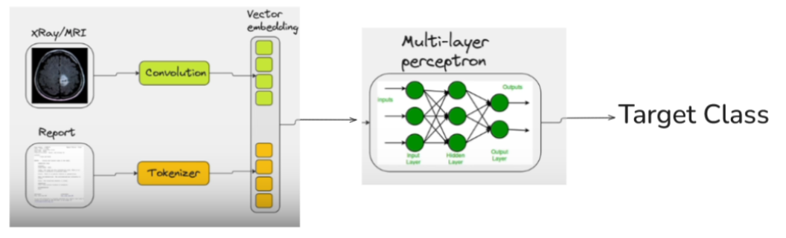

# LLM-CNN-MLP

This project is aimed at researching if combining a textual (non-multimodal) LLM (to read the report of a patient) with a CNN (to analyse the X-ray images corresponding to the reports) gives a better result at binary classification of the lung/heart diseases as compared to a CNN alone.

The output from the CNN and LLM is converted into a vector embedding that's input into a Multi-Layer-Perceptron, which outputs a binary classification.

## Data
Indiana University Chest X-ray dataset was used in the project.
The dataset contains 7,470 pairs of images and reports and measures 14.19 GB.
IU X-ray (Demner-Fushman et al., 2016) can be accessed [here](https://www.kaggle.com/datasets/raddar/chest-xrays-indiana-university)

## LLM Model

BioBERT tokenizer was used to process and convert the words in the reports into vector embeddings. BioBERT has 110 Million parameters.
It's been proven that BioBERT can more accurately recognize medical entities and their context. Refer to the research paper [here](https://arxiv.org/abs/1901.08746#:~:text=the%20same%20architecture%20across%20tasks%2C,analysis%20results%20show%20that%20pre)

## CNN Model

The architecture of EfficientNet-B1 is used to process and convert the images into vector embeddings. EfficientNet-B1 is a Depp CNN pretrained on Medical dataset (ImageNet) and has ~6.5 Million trainable parameters. EfficientNet‑B1 component is fine‑tuned on the dataset I used, while the BioBERT model remains frozen. I've leveraged pre‑trained knowledge from both models but only updated the image branch and the fusion MLP during training. It's been proven that EfficientNet architecture gives slightly better accuracy per parameter. Refer to the research paper [here](https://arxiv.org/pdf/1905.11946)

## Multi-Layer Perceptron

The outputs from EfficientNet‑B1 (≈1280‑dimensional) and BioBERT (≈768‑dimensional) are concatenated (using Adaptive Average Pooling) and then fed into a two‑layer MLP (with a hidden layer of 256 units) that produces the final binary classification.
A dropout rate of 0.5 was incorporated in the fusion MLP layer to mitigate overfitting by randomly deactivating 50% of the neurons during training.

## Parameters

**Tech Stack**:
- Python
- NumPy
- Pandas
- PyTorch
- Scikit-Learn

| Parameters | Specification |
| --- | --- |
| Optimizer | AdamW |
| Regulaization | AdamW weight_decay = 0.01 |
| Loss Function | Cross Entropy |
| Adaptive Learning Rate | LinearLR (1.0 - 0.1) |
| Learning Rate | 0.001 |
| Batch Normalization | 512 |
| Number of Epochs | 40 |
| Dropout rate on Layer 1 | 0.5 |
| Number of parameters bring trained | 525,058 |
| Train / Test data ratio | 80 : 20 |

**Key Points**

- Used Weighted Classes in training to have a fair representation of under-represented classes
- Used StratifiedShuffleSplit to have similar proportions of different types of classes in both the training and valuation phases

## Results

**Model Evaluation Metrics**:
- Loss
- Accuracy
- Precision
- Recall
- F1
- Specificity
- ROC AUC
- PR AUC

| Epoch | Phase | Loss   | Accuracy | Precision | Recall | F1-Score | Specificity | ROC AUC | PR AUC  |
|-------|-------|--------|----------|-----------|--------|----------|-------------|---------|---------|
| 1     | Train | 0.4835 | 0.8003   | 0.8585    | 0.8252 | 0.8415   | 0.7556      | 0.8701  | 0.9212  |
|       | Val   | 0.2789 | 0.8910   | 0.9232    | 0.9058 | 0.9144   | 0.8644      | 0.9531  | 0.9723  |
| 2     | Train | 0.3862 | 0.8527   | 0.8965    | 0.8713 | 0.8837   | 0.8192      | 0.9229  | 0.9558  |
|       | Val   | 0.2453 | 0.9098   | 0.9457    | 0.9120 | 0.9286   | 0.9058      | 0.9649  | 0.9787  |
| 3     | Train | 0.3930 | 0.8594   | 0.9010    | 0.8776 | 0.8892   | 0.8267      | 0.9317  | 0.9597  |
|       | Val   | 0.2142 | 0.9145   | 0.9549    | 0.9099 | 0.9319   | 0.9228      | 0.9731  | 0.9843  |
| 4     | Train | 0.4044 | 0.8672   | 0.9001    | 0.8923 | 0.8962   | 0.8220      | 0.9351  | 0.9625  |
|       | Val   | 0.3102 | 0.8809   | 0.9587    | 0.8513 | 0.9018   | 0.9341      | 0.9605  | 0.9774  |
| 5     | Train | 0.4078 | 0.8695   | 0.9000    | 0.8965 | 0.8983   | 0.8211      | 0.9371  | 0.9632  |
|       | Val   | 0.3149 | 0.8795   | 0.9790    | 0.8304 | 0.8986   | 0.9680      | 0.9684  | 0.9817  |
| 6     | Train | 0.3837 | 0.8793   | 0.9122    | 0.8986 | 0.9053   | 0.8446      | 0.9451  | 0.9678  |
|       | Val   | 0.2633 | 0.9098   | 0.9691    | 0.8880 | 0.9268   | 0.9492      | 0.9721  | 0.9837  |
| 7     | Train | 0.3742 | 0.8875   | 0.9173    | 0.9067 | 0.9120   | 0.8531      | 0.9498  | 0.9716  |
|       | Val   | 0.2337 | 0.9172   | 0.9581    | 0.9110 | 0.9340   | 0.9284      | 0.9766  | 0.9856  |
| 8     | Train | 0.3613 | 0.8946   | 0.9158    | 0.9206 | 0.9182   | 0.8479      | 0.9551  | 0.9728  |
|       | Val   | 0.2820 | 0.9105   | 0.9724    | 0.8859 | 0.9271   | 0.9548      | 0.9770  | 0.9860  |
| 9     | Train | 0.3933 | 0.8936   | 0.9216    | 0.9119 | 0.9168   | 0.8606      | 0.9544  | 0.9725  |
|       | Val   | 0.2468 | 0.9166   | 0.9695    | 0.8984 | 0.9326   | 0.9492      | 0.9769  | 0.9849  |
| 10    | Train | 0.4257 | 0.8887   | 0.9120    | 0.9151 | 0.9135   | 0.8413      | 0.9505  | 0.9697  |
|       | Val   | 0.3027 | 0.9071   | 0.9756    | 0.8775 | 0.9239   | 0.9605      | 0.9764  | 0.9856  |
| 11    | Train | 0.3537 | 0.9052   | 0.9325    | 0.9190 | 0.9257   | 0.8804      | 0.9638  | 0.9794  |
|       | Val   | 0.3166 | 0.9058   | 0.9755    | 0.8754 | 0.9227   | 0.9605      | 0.9777  | 0.9862  |
| 12    | Train | 0.3799 | 0.9047   | 0.9261    | 0.9256 | 0.9258   | 0.8672      | 0.9623  | 0.9770  |
|       | Val   | 0.3149 | 0.9166   | 0.9695    | 0.8984 | 0.9326   | 0.9492      | 0.9772  | 0.9848  |
| 13    | Train | 0.4177 | 0.8934   | 0.9196    | 0.9140 | 0.9168   | 0.8564      | 0.9583  | 0.9747  |
|       | Val   | 0.2966 | 0.9125   | 0.9769    | 0.8848 | 0.9286   | 0.9623      | 0.9792  | 0.9861  |
| 14    | Train | 0.4002 | 0.8983   | 0.9240    | 0.9172 | 0.9206   | 0.8644      | 0.9596  | 0.9747  |
|       | Val   | 0.3319 | 0.9044   | 0.9721    | 0.8764 | 0.9218   | 0.9548      | 0.9781  | 0.9853  |
| 15    | Train | 0.4284 | 0.8968   | 0.9216    | 0.9175 | 0.9195   | 0.8597      | 0.9574  | 0.9710  |
|       | Val   | 0.2704 | 0.9314   | 0.9621    | 0.9298 | 0.9457   | 0.9341      | 0.9782  | 0.9857  |
| 16    | Train | 0.4073 | 0.9062   | 0.9231    | 0.9316 | 0.9274   | 0.8606      | 0.9624  | 0.9757  |
|       | Val   | 0.3138 | 0.9253   | 0.9637    | 0.9183 | 0.9405   | 0.9379      | 0.9765  | 0.9827  |
| 17    | Train | 0.4289 | 0.9012   | 0.9214    | 0.9251 | 0.9232   | 0.8583      | 0.9610  | 0.9746  |
|       | Val   | 0.3483 | 0.9098   | 0.9713    | 0.8859 | 0.9266   | 0.9529      | 0.9803  | 0.9866  |
| 18    | Train | 0.4202 | 0.9071   | 0.9279    | 0.9274 | 0.9277   | 0.8705      | 0.9623  | 0.9742  |
|       | Val   | 0.3279 | 0.9320   | 0.9672    | 0.9257 | 0.9460   | 0.9435      | 0.9770  | 0.9819  |
| 19    | Train | 0.4269 | 0.9106   | 0.9308    | 0.9300 | 0.9304   | 0.8757      | 0.9643  | 0.9774  |
|       | Val   | 0.3163 | 0.9320   | 0.9713    | 0.9215 | 0.9457   | 0.9510      | 0.9800  | 0.9855  |
| 20    | Train | 0.4353 | 0.9170   | 0.9319    | 0.9395 | 0.9357   | 0.8766      | 0.9647  | 0.9738  |
|       | Val   | 0.3362 | 0.9287   | 0.9743    | 0.9131 | 0.9427   | 0.9567      | 0.9779  | 0.9840  |
| 21    | Train | 0.4511 | 0.9131   | 0.9313    | 0.9337 | 0.9325   | 0.8762      | 0.9644  | 0.9747  |
|       | Val   | 0.2964 | 0.9381   | 0.9655    | 0.9372 | 0.9511   | 0.9397      | 0.9781  | 0.9823  |
| 22    | Train | 0.4753 | 0.9081   | 0.9260    | 0.9313 | 0.9287   | 0.8663      | 0.9620  | 0.9720  |
|       | Val   | 0.3852 | 0.9166   | 0.9803    | 0.8880 | 0.9319   | 0.9680      | 0.9810  | 0.9865  |
| 23    | Train | 0.4366 | 0.9146   | 0.9272    | 0.9410 | 0.9341   | 0.8672      | 0.9642  | 0.9718  |
|       | Val   | 0.3296 | 0.9509   | 0.9623    | 0.9613 | 0.9618   | 0.9322      | 0.9763  | 0.9793  |
| 24    | Train | 0.4317 | 0.9113   | 0.9336    | 0.9279 | 0.9307   | 0.8814      | 0.9682  | 0.9783  |
|       | Val   | 0.5564 | 0.8836   | 0.9839    | 0.8325 | 0.9019   | 0.9755      | 0.9812  | 0.9869  |
| 25    | Train | 0.4726 | 0.9165   | 0.9307    | 0.9400 | 0.9353   | 0.8743      | 0.9636  | 0.9711  |
|       | Val   | 0.4875 | 0.9112   | 0.9768    | 0.8827 | 0.9274   | 0.9623      | 0.9796  | 0.9842  |
| 26    | Train | 0.4748 | 0.9224   | 0.9379    | 0.9416 | 0.9397   | 0.8879      | 0.9661  | 0.9739  |
|       | Val   | 0.3527 | 0.9435   | 0.9668    | 0.9445 | 0.9555   | 0.9416      | 0.9781  | 0.9826  |
| 27    | Train | 0.4518 | 0.9244   | 0.9376    | 0.9452 | 0.9414   | 0.8870      | 0.9696  | 0.9766  |
|       | Val   | 0.4231 | 0.9388   | 0.9655    | 0.9382 | 0.9517   | 0.9397      | 0.9739  | 0.9780  |
| 28    | Train | 0.4571 | 0.9254   | 0.9444    | 0.9392 | 0.9418   | 0.9007      | 0.9692  | 0.9769  |
|       | Val   | 0.4184 | 0.9327   | 0.9703    | 0.9236 | 0.9464   | 0.9492      | 0.9751  | 0.9788  |
| 29    | Train | 0.4782 | 0.9239   | 0.9360    | 0.9463 | 0.9411   | 0.8837      | 0.9676  | 0.9745  |
|       | Val   | 0.4525 | 0.9334   | 0.9703    | 0.9246 | 0.9469   | 0.9492      | 0.9763  | 0.9806  |
| 30    | Train | 0.4986 | 0.9247   | 0.9379    | 0.9455 | 0.9417   | 0.8875      | 0.9648  | 0.9715  |
|       | Val   | 0.5483 | 0.9051   | 0.9788    | 0.8712 | 0.9219   | 0.9661      | 0.9801  | 0.9858  |
| 31    | Train | 0.4893 | 0.9232   | 0.9366    | 0.9444 | 0.9405   | 0.8851      | 0.9671  | 0.9734  |
|       | Val   | 0.3963 | 0.9482   | 0.9660    | 0.9529 | 0.9594   | 0.9397      | 0.9759  | 0.9794  |
| 32    | Train | 0.4764 | 0.9266   | 0.9403    | 0.9458 | 0.9430   | 0.8922      | 0.9684  | 0.9733  |
|       | Val   | 0.4877 | 0.9233   | 0.9741    | 0.9047 | 0.9381   | 0.9567      | 0.9788  | 0.9829  |
| 33    | Train | 0.4900 | 0.9286   | 0.9412    | 0.9481 | 0.9446   | 0.8936      | 0.9682  | 0.9744  |
|       | Val   | 0.5292 | 0.9098   | 0.9779    | 0.8796 | 0.9261   | 0.9642      | 0.9781  | 0.9829  |
| 34    | Train | 0.4758 | 0.9296   | 0.9429    | 0.9479 | 0.9454   | 0.8969      | 0.9672  | 0.9722  |
|       | Val   | 0.4809 | 0.9226   | 0.9795    | 0.8984 | 0.9372   | 0.9661      | 0.9815  | 0.9863  |
| 35    | Train | 0.4651 | 0.9311   | 0.9491    | 0.9434 | 0.9462   | 0.9091      | 0.9702  | 0.9753  |
|       | Val   | 0.4367 | 0.9421   | 0.9707    | 0.9382 | 0.9542   | 0.9492      | 0.9766  | 0.9800  |
| 36    | Train | 0.4957 | 0.9274   | 0.9393    | 0.9484 | 0.9438   | 0.8898      | 0.9675  | 0.9731  |
|       | Val   | 0.4612 | 0.9307   | 0.9712    | 0.9194 | 0.9446   | 0.9510      | 0.9789  | 0.9832  |
| 37    | Train | 0.4512 | 0.9296   | 0.9413    | 0.9497 | 0.9455   | 0.8936      | 0.9714  | 0.9761  |
|       | Val   | 0.4151 | 0.9468   | 0.9670    | 0.9497 | 0.9583   | 0.9416      | 0.9767  | 0.9800  |
| 38    | Train | 0.4374 | 0.9330   | 0.9500    | 0.9455 | 0.9477   | 0.9105      | 0.9726  | 0.9774  |
|       | Val   | 0.4769 | 0.9341   | 0.9745    | 0.9215 | 0.9473   | 0.9567      | 0.9770  | 0.9811  |
| 39    | Train | 0.4165 | 0.9384   | 0.9563    | 0.9473 | 0.9518   | 0.9223      | 0.9769  | 0.9822  |
|       | Val   | 0.4455 | 0.9455   | 0.9689    | 0.9455 | 0.9571   | 0.9454      | 0.9774  | 0.9807  |
| 40    | Train | 0.5369 | 0.9242   | 0.9371    | 0.9455 | 0.9413   | 0.8861      | 0.9664  | 0.9722  |
|       | Val   | 0.4894 | 0.9307   | 0.9723    | 0.9183 | 0.9445   | 0.9529      | 0.9759  | 0.9797  |

## Conclusion

| Metric       | LLM+MLP                  | CNN+MLP                  | LLM+CNN+MLP              | Winner                   |
|--------------|--------------------------|--------------------------|--------------------------|--------------------------|
| Loss         | **0.2227** (34) → 0.2646 (40) | -                        | 0.3296 (23) → 0.4894 (40)| LLM+MLP                  |
| Accuracy     | 0.9321 (18) → 0.8903 (40) | 0.6968 (21) → 0.6854 (40) | **0.9509** (23) → 0.9307 (40) | LLM+CNN+MLP (+2.02%)    |
| Precision    | 0.9815 (5) → 0.9696 (40)  | -                        | **0.9839** (24) → 0.9723 (40) | LLM+CNN+MLP (+0.24%)    |
| Recall       | 0.9546 (6) → 0.8536 (40)  | -                        | **0.9613** (23) → 0.9183 (40) | LLM+CNN+MLP (+0.70%)    |
| F1-Score     | 0.9457 (18) → 0.9079 (40) | 0.7666 (22) → 0.7293 (40) | **0.9618** (23) → 0.9445 (40) | LLM+CNN+MLP (+1.70%)    |
| Specificity  | **0.9893** (1) → 0.9537 (40) | -                        | 0.9755 (24) → 0.9529 (40) | LLM+MLP (+1.41%)        |
| ROC AUC      | 0.9732 (34) → 0.9729 (40) | 0.7420 (34) → 0.7420 (40) | **0.9815** (34) → 0.9759 (40) | LLM+CNN+MLP (+0.85%)    |
| PR AUC       | 0.9835 (32) → 0.9828 (40) | 0.7995 (39) → 0.7995 (40) | **0.9869** (24) → 0.9797 (40) | LLM+CNN+MLP (+0.35%)    |

The model didn't overfit as the performance metrics kept on improving. This model performs exceptionally well compared to using a textual LLM to read reports or a CNN to study the images, as shown in the table above which compares the best metrics achieved during the training and at the end of training (i.e., at 40th epoch). The key features of the LLM+CNN+MLP model are as follows:

**Notable Features**

- Transfer Learning: Uses pre-trained models to leverage knowledge from ImageNet and PubMed
- Freezing: Frozen the backbone layers of both the LLM and the CNN, training only the MLP
- Class Imbalance Handling: Uses weighted loss function based on class frequencies
- Comprehensive Metrics: Calculates and reports 8 different performance metrics
- Learning Rate Schedules: Uses LinearLR to reduce learning rates as epochs progress to prevent overshooting or oscillating in a minima.

## Further Improvements

The accuracy of the LLM+CNN+MLP model can be improved further if considerable computational resources are available by following the following points:

- Use the MIMIC-CXR dataset containing paired chest X-rays and radiology reports (377,110 images and 227,827 reports). The dataset measures 1.7TB.
- Use data augmentation of the images to help the CNN model generalise well.
- Train for more epochs.
- Use [BiMediX2’s](https://github.com/mbzuai-oryx/BiMediX2) projector layer to map CNN and LLM embeddings into a shared space for better alignment.
